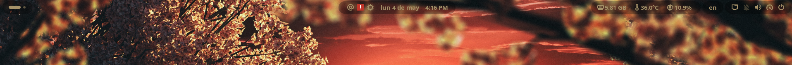
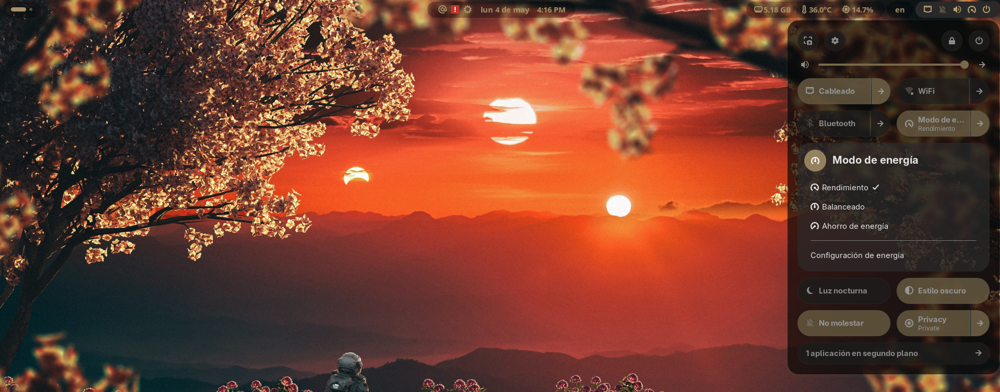

# Bar Enhanced (GNOME 4X Extension)  

**Bar Enhanced** is a premium GNOME Shell extension designed for high-end desktop customization. It transforms the standard GNOME interface into a balanced, professional environment with modern visual controls, adaptive theming, and an intuitive user experience.

Developed and maintained by **MrVanguardia**, this project is an advanced evolution of the original **Open Bar** extension, preserving its legacy while introducing state-of-the-art features and a modern architectural approach.

## 🙏 Acknowledgments
This project is built upon the solid foundation of **Open Bar**, originally created by **neuromorph**. We express our deep gratitude to the original author for their innovative work which made this enhanced version possible.

## ✨ What's New in Bar Enhanced?

- **Modern Navigation UI:** Replaced the legacy sidebar with a clean, categorized top-tab layout inspired by V-Shell for faster access to settings.
- **Improved Theme Store:** A completely rebuilt online browser for community icon themes with live previews, download status, and better layout.
- **Enhanced Responsiveness:** Optimized preference window that adapts to different screen resolutions, ensuring no buttons or controls are cut off.
- **Clean Welcome Experience:** A new streamlined landing page with quick-start guides and daily inspiration.
- **Optimized Codebase:** Refactored for better performance and compatibility with the latest GNOME versions (45-50).

## 🚀 Key Features

- **Adaptive Theming Engine:** Extract color palettes from your wallpaper in real-time (Dark, Light, Pastel, and True-Color modes).
- **Advanced Geometry:** Precise control over corner rounding (from sharp to pill-shaped), border thickness, and neon luminosity glow.
- **Glassmorphism:** Premium transparency and blur effects for the Top Bar, Pop-up Menus, and Dash/Dock.
- **Efficiency Mode (Window-Max):** Intelligent optimization that adjusts the bar's appearance automatically when a window is maximized.
- **Application Tunneling:** Experimental CSS injection to sync your shell theme with GTK3, GTK4, and Flatpak applications.

## 📥 Installation

To install **Bar Enhanced** correctly, you must clone the repository and then move the extension folder to your local GNOME extensions directory.

1. **Clone the repository:**
   ```bash
   git clone https://github.com/MrVanguardia/Bar-Enhanced.git
   ```
2. **Install the extension:**
   ```bash
   mkdir -p ~/.local/share/gnome-shell/extensions/
   cp -r Bar-Enhanced/bar-enhanced@mrvanguardia ~/.local/share/gnome-shell/extensions/
   ```
3. **Restart GNOME Shell:**
   - **Wayland:** Log out and log back in.
   - **Xorg:** Press `Alt+F2`, type `r`, and hit `Enter`.
4. **Enable the extension:** Use the *Extensions* app or *Extension Manager*.

## 🎨 Professional Customization
- **Bar Styles:** Choose from Mainland, Floating, Trilands, or Island layouts.
- **System-Wide Sync:** Propagate accent colors across the entire shell ecosystem.
- **Profile Management:** Export your setups as code snippets or JSON files to share with the community.

## 📸 Screenshots

*Preview of Bar Enhanced in action:*

  
*Example of the Floating style with adaptive thematic.*

  
*New navigation interface with top tabs.*


## 📜 License
This program is free software: you can redistribute it and/or modify it under the terms of the **GNU General Public License version 3 (GPL-3.0)**.

Copyright (C) 2024-2026 MrVanguardia.  
Original core logic Copyright (C) neuromorph.

---
*Love the project? Give it a ⭐ on [GitHub](https://github.com/MrVanguardia/Bar-Enhanced) and share your rice!*