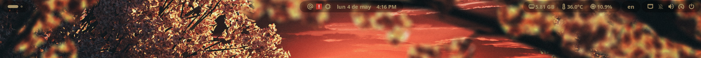
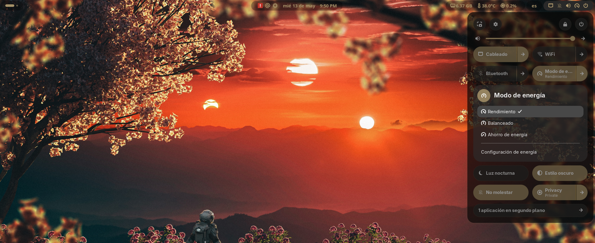
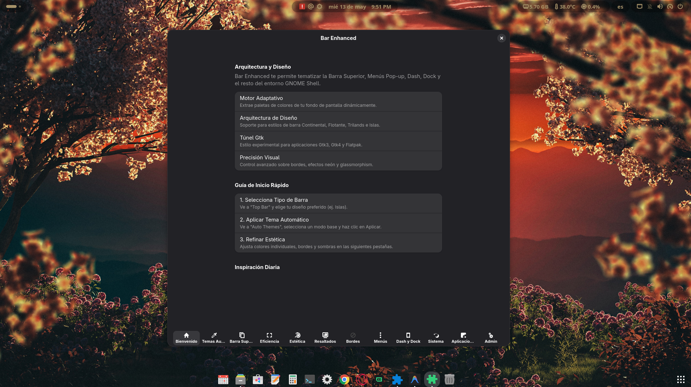
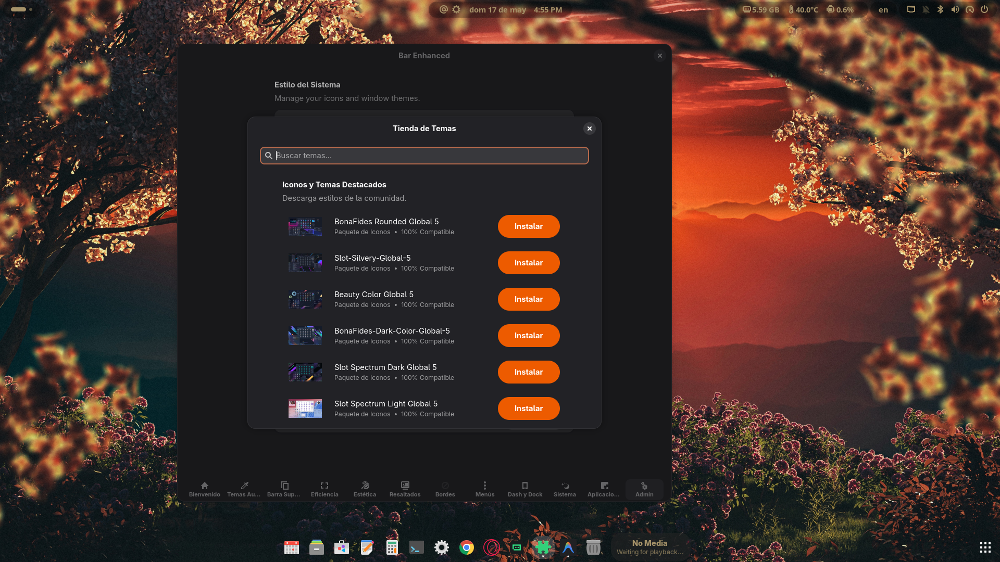
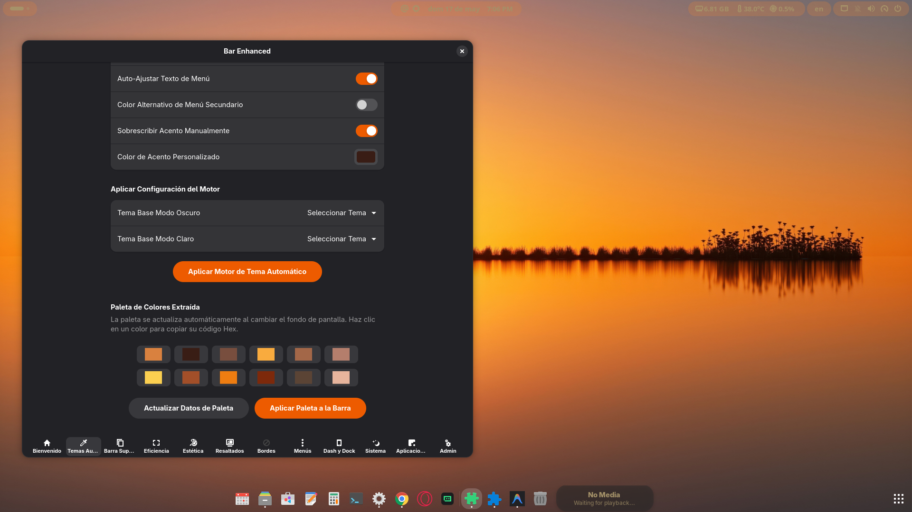
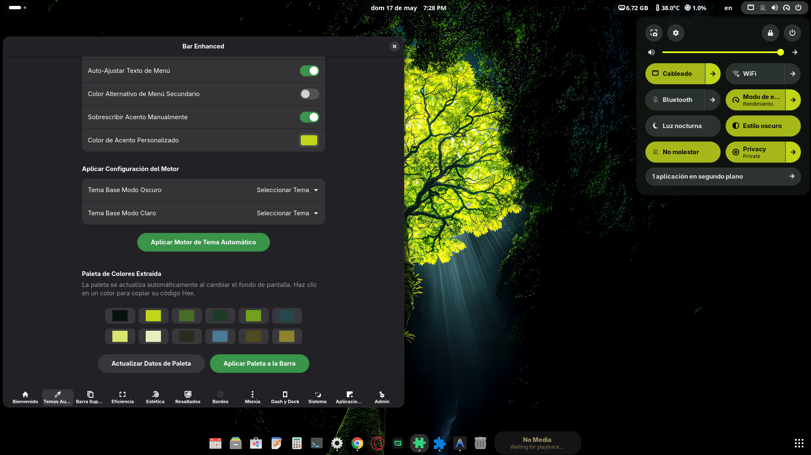

# Bar Enhanced (GNOME 4X Extension)  

<p align="center">
  <a href="https://github.com/MrVanguardia/Bar-Enhanced/stargazers">
    
  </a>
  <a href="https://github.com/MrVanguardia/Bar-Enhanced/network/members">
    
  </a>
  <a href="https://github.com/MrVanguardia/Bar-Enhanced/issues">
    
  </a>
  <a href="https://github.com/MrVanguardia/Bar-Enhanced/blob/main/LICENSE">
    
  </a>
  <a href="https://extensions.gnome.org/">
    
  </a>
  <br/>
  
  
  <a href="https://github.com/MrVanguardia/Bar-Enhanced/commits/main">
    
  </a>
  <a href="https://github.com/MrVanguardia/Bar-Enhanced/pulls">
    
  </a>
  <a>
    
  </a>
</p>


**Bar Enhanced** is a premium GNOME Shell extension designed for high-end desktop customization. It transforms the standard GNOME interface into a balanced, professional environment with modern visual controls, adaptive theming, and an intuitive user experience.

Developed and maintained by **MrVanguardia**, this project is an advanced evolution of the original **Open Bar** extension, preserving its legacy while introducing state-of-the-art features and a modern architectural approach.

## 🙏 Acknowledgments
This project is built upon the solid foundation of **Open Bar**, originally created by **neuromorph**. We express our deep gratitude to the original author for their innovative work which made this enhanced version possible.

We also incorporate and build upon the source code of **Dash to Dock**, an amazing project created by **Michele G (micheleg)** and its contributors. We thank them for their continuous work on the GNOME dock ecosystem. The Dash to Dock components included in this project retain their original GPL license.

We also incorporate and build upon the source code of **Dynamic Music Pill**, an awesome module created by **Andbal23**. We thank them for their work on creating an amazing MPRIS integration for GNOME. The Dynamic Music Pill components included in this project retain their original GPL license.

We also incorporate and build upon the source code of **Vitals**, a comprehensive system sensor monitor created by **corecoding**. We thank them for their fantastic work in tracking hardware statistics. The Vitals components included in this project retain their original GPL license.

## ✨ What's New in Bar Enhanced?

- **Modern Navigation UI:** Replaced the legacy sidebar with a clean, categorized top-tab layout inspired by V-Shell for faster access to settings.
- **Improved Theme Store:** A completely rebuilt online browser for community icon themes with live previews, download status, and better layout.
- **Enhanced Responsiveness:** Optimized preference window that adapts to different screen resolutions, ensuring no buttons or controls are cut off.
- **Clean Welcome Experience:** A new streamlined landing page with quick-start guides and daily inspiration.
- **Optimized Codebase:** Refactored for better performance and compatibility with the latest GNOME versions (45-50).

## 🚀 Key Features

- **Adaptive Theming Engine:** Extract color palettes from your wallpaper in real-time (Dark, Light, Pastel, and True-Color modes).
- **Advanced Geometry:** Precise control over corner rounding (from sharp to pill-shaped), border thickness, and neon luminosity glow.
- **Glassmorphism translúcido:** Premium dynamic transparency and frosted-glass blur effects applied across the Top Bar, Pop-up Menus, Notification Banners, overview Search Results, Dash/Dock, Vitals, Bluetooth Menu, and Dynamic Music Pill. It fully respects Light and Dark themes out of the box (rendering bright frosted glass or sleek dark glass accordingly) and automatically suspends the blur effect when background opacity is solid (`1.0`) for optimal rendering performance.
- **Efficiency Mode (Window-Max):** Intelligent optimization that adjusts the bar's appearance automatically when a window is maximized.
- **Application Tunneling:** Experimental CSS injection to sync your shell theme with GTK3, GTK4, and Flatpak applications.

## 🖥️ GDM Center (Login Screen Customizer)

<p align="center">
  
  
  
  
</p>

**Bar Enhanced GDM Center** is a state-of-the-art, system-integrated control center designed to customize your GNOME Login Screen safely. Unlike third-party applications that overwrite raw binary resources and brick display managers, our GDM Center uses a sandboxed architecture and modern injection pathways to deliver stunning visual customization with absolute stability.

> [!TIP]
> 🌌 **Elevate Your Greeter Experience with Premium Wallpapers**
> 
> A spectacular login screen deserves breathtaking artwork. Discover handpicked, stunning high-resolution backgrounds and visual assets curated specifically for modern lockscreens:
> 
> <a href="https://4kwallpapers.com/" target="_blank"></a>

---

### 🎨 Visual & Performance Control Panel

<table>
  <thead>
    <tr>
      <th align="left">🔧 GDM Panel Section</th>
      <th align="left">🌟 Visual & Performance Highlights</th>
      <th align="left">🛡️ Under-the-Hood Technology</th>
    </tr>
  </thead>
  <tbody>
    <tr>
      <td><b>🎨 Appearance</b></td>
      <td>Synchronize custom Accent Colors, Light/Dark theme, and set custom Shell, Icon, and Cursor packages.</td>
      <td><code>Dynamic Folder Scanner</code></td>
    </tr>
    <tr>
      <td><b>🖼️ Login Screen</b></td>
      <td>Change GDM background wallpapers and logos with secure sandboxed permission handling.</td>
      <td><code>Gtk.FileDialog</code> & <code>universal 644 chmod</code></td>
    </tr>
    <tr>
      <td><b>🔒 Password Box</b></td>
      <td>Apply glassmorphic opacity scaling, solid background colors, and frosted-glass blur effects.</td>
      <td><code>-st-background-blur</code> engine</td>
    </tr>
    <tr>
      <td><b>🌗 Night Light</b></td>
      <td>Full color temperature adjustment scale, automatic schedules, and custom start/end hour timers.</td>
      <td><code>ColorManager Settings Bindings</code></td>
    </tr>
    <tr>
      <td><b>🔉 Auditory Alert</b></td>
      <td>Dynamic sound theme detector to automatically scan and apply system audio themes.</td>
      <td><code>Gio.File</code> folder enum loader</td>
    </tr>
    <tr>
      <td><b>🖱️ Peripherals</b></td>
      <td>Precise mouse speed curves, natural scrolling, touchpad gestures, and cursor scale multiplier.</td>
      <td><code>accel-profile</code> & <code>tap-to-click</code> GSettings</td>
    </tr>
    <tr>
      <td><b>🔋 Power & Sleep</b></td>
      <td>Fine-tune AC & battery suspension, idle screen dim timers, and physical power button actions.</td>
      <td><code>sleep-inactive-ac-timeout</code></td>
    </tr>
    <tr>
      <td><b>🕒 Clock & Top Bar</b></td>
      <td>Toggle seconds, dates, weekday, battery percentage, and select clock layouts (12h or 24h).</td>
      <td><code>clock-show-seconds</code> & <code>clock-format</code></td>
    </tr>
    <tr>
      <td><b>🖥️ Display Sync</b></td>
      <td>Mirror multi-monitor screen layouts, resolution coordinates, and experimental fractional scaling.</td>
      <td><code>monitors.xml</code> parser & Mutter DBus</td>
    </tr>
    <tr>
      <td><b>🚨 Safe Restoration</b></td>
      <td>A dedicated factory reset button to wipe GDM custom configs and cleanly return GDM to stock settings.</td>
      <td><code>pkexec</code> destructive cleanup shell script</td>
    </tr>
  </tbody>
</table>

> [!IMPORTANT]
> ⚠️ **GDM Custom Theme & Wallpaper Requirements**
> 
> To apply custom login backgrounds, accent colors, and custom card/password styles on GDM, your system needs the official GNOME Shell `user-theme` extension installed system-wide.
> 
> **The GDM Center will attempt to detect and install it automatically** when you click **Apply** (using DNF on Fedora, APT on Ubuntu/Debian, or Pacman on Arch Linux). 
> 
> If you need to install it manually as a fallback:
> * **Fedora:** `sudo dnf install gnome-shell-extension-user-theme`
> * **Ubuntu / Debian:** `sudo apt install gnome-shell-extension-user-theme`
> * **Arch Linux:** `sudo pacman -S gnome-shell-extensions`

---

## 📥 Installation

To install **Bar Enhanced** correctly, you must clone the repository and then move the extension folder to your local GNOME extensions directory.

1. **Clone the repository:**
   ```bash
   git clone https://github.com/MrVanguardia/Bar-Enhanced.git
   ```
2. **Install the extension:**
   ```bash
   mkdir -p ~/.local/share/gnome-shell/extensions/
   cp -r Bar-Enhanced/bar-enhanced@mrvanguardia ~/.local/share/gnome-shell/extensions/
   ```
3. **Restart GNOME Shell:**
   - **Wayland:** Log out and log back in.
   - **Xorg:** Press `Alt+F2`, type `r`, and hit `Enter`.
4. **Enable the extension:** Use the *Extensions* app or *Extension Manager*.

### 🔄 Quick Update

If you already have the repository cloned, run this command from the parent folder to pull the latest changes, copy the extension files, compile the schemas, and prepare it for reload:
```bash
cd Bar-Enhanced && git pull && cp -r bar-enhanced@mrvanguardia ~/.local/share/gnome-shell/extensions/ && glib-compile-schemas ~/.local/share/gnome-shell/extensions/bar-enhanced@mrvanguardia/schemas
```

## 🎨 Professional Customization
- **Bar Styles:** Choose from Mainland, Floating, Trilands, or Island layouts.
- **System-Wide Sync:** Propagate accent colors across the entire shell ecosystem.
- **Profile Management:** Export your setups as code snippets or JSON files to share with the community.

## 📸 Screenshots

*Preview of Bar Enhanced in action:*

  
*Example of the Floating style with adaptive thematic.*

  
*New navigation interface with top tabs.*

  
*Example of the interface.*

  
*New community Theme Store with active compatibility checker.*

  
*Real-time wallpaper palette extraction with live contrast-aware bar and menu sync.*

  
*Complete aesthetic sync matching top bar, popups, and quick settings toggles.*


## 📜 License
This program is free software: you can redistribute it and/or modify it under the terms of the **GNU General Public License version 3 (GPL-3.0)**.
* **Bar Enhanced:** Copyright (C) 2024-2026 MrVanguardia.
* **Original core logic:** Copyright (C) neuromorph.
* **Dash to Dock components:** Copyright (C) Michele G.
* **Dynamic Music Pill components:** Copyright (C) Andbal23.
* **Vitals components:** Copyright (C) corecoding.

## 📄 Additional documentation

- [👥 Contributors](COLABORADORES.md)
- [📢 Third-party notice](AVISO_DE_TERCEROS.md)
- [📋 Theme Vanguard Gold](Temas%20Vanguard%20Gold.txt)

---
*Love the project? Give it a ⭐ on [GitHub](https://github.com/MrVanguardia/Bar-Enhanced) and share your rice!*
